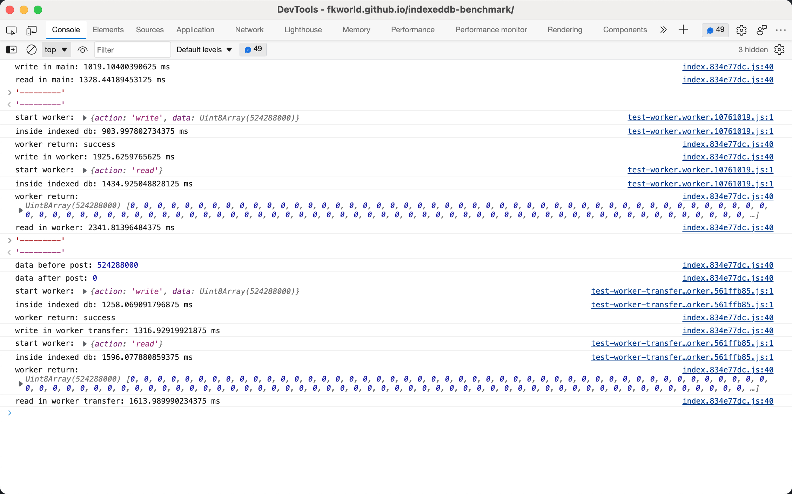

# indexedb-benchmark

## 测试内容

1. 在主线程中读写数据。
2. 在 worker 中读写数据。
3. 在 worker 中读写数据，并使用 transfer。

## 结论

1. indexeddb 虽然是异步读写，但是依然**会阻塞主线程**。原因是其涉及到数据的结构化克隆。所以在读写大量数据时，需要使用 worker。
2. 在 worker 中 indexeddb 的读写速度比在主线程中**慢很多**。原因未知，可能与 cpu 占用有关。
3. worker transfer 能大大增加主线程与 worker 间的数据传输速度。但要注意交出控制权后，处理逻辑会有相应变化。

## 截图



## 本地调试

环境准备：node, npm

```
# 安装依赖
npm install

# 启动 dev
npm run dev

# 编译
npm run build
```
